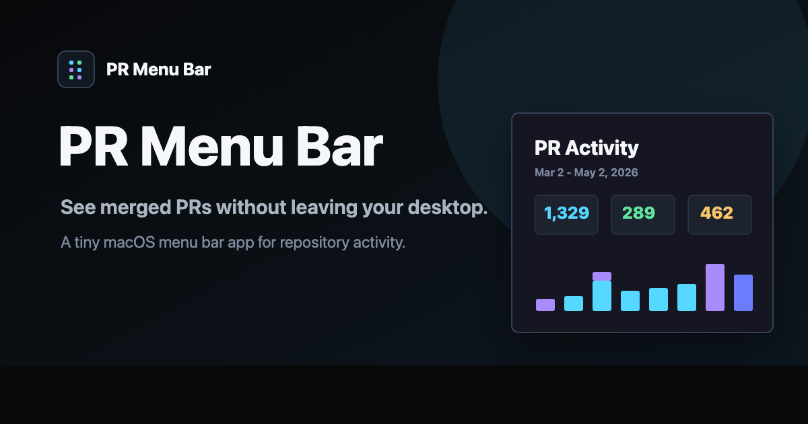

# PR Menu Bar

See merged PRs without leaving your desktop.

PR Menu Bar is a tiny macOS menu bar app for watching merged pull request activity across team and personal GitHub repositories. It is intentionally lightweight: sample data out of the box, live GitHub data when launched with a token, repository breakdowns, and refresh behavior that keeps the last useful view visible instead of blanking out on failure.

Landing page: https://mean-weasel.github.io/prbar/



## Features

- Watch merged pull request activity from the macOS menu bar.
- Scan activity over a configurable time window.
- Break activity down by repository.
- Use sample data immediately, or provide a GitHub token for live data.
- Keep the previous activity visible when refreshes fail.

## Current Shape

- SwiftUI menu bar app scaffolded with XcodeGen.
- Unit tests for the domain model and GitHub provider path.
- CI checks for formatting, build, tests, app smoke, and Swift file size.
- `pr-chart-mobile.html` is the source for the GitHub Pages landing page, deployed by `.github/workflows/pages.yml`.
- `Docs/Marketing.md` contains reusable launch copy, positioning, CTAs, and asset references.

## Local Development

```bash
make generate
make test
make ci-local
```

`make app-smoke` builds the app in Release mode and verifies the bundle exists.

## iOS Prototype App

The native iOS app lives under `apple/` and is generated with XcodeGen:

```bash
make ios-generate
make ios-ci-local
```

The first implementation is fixture-backed and follows the reviewed HTML mockup in
`mockups/ios/`.

## Live GitHub Data

The app uses sample data when it cannot find GitHub credentials. For live data, it
first checks `PR_MENU_BAR_GITHUB_TOKEN`, then falls back to your authenticated
GitHub CLI token from `gh auth token`.

If you have the GitHub CLI installed and authenticated (`gh auth login`):

```bash
make run-live
```

The app also tries common GitHub CLI install paths when launched normally from
macOS, so an already-authenticated `gh` install can connect without an environment
variable. The equivalent explicit token form is:

```bash
PR_MENU_BAR_GITHUB_TOKEN=github_pat_xxx make run
```

The token needs repository read access for the repositories you want to track. Missing
or blank tokens keep the app on sample data. OAuth, keychain storage, signing,
notarization, and distribution are intentionally out of scope for this prototype.
In-app GitHub sign-in and credential storage remain an open product decision; the
environment-token path is the supported live-data path for now.

The live provider currently discovers repositories with pull access, fetches merged pull
requests through GitHub GraphQL search, filters them to PRs merged by the authenticated
user, paginates high-volume result sets, and preserves the last visible activity if a
refresh fails. The popover header shows whether the app is using sample data or GitHub
data.

Manual refresh is available from the popover and is disabled while a refresh is already
running. Scheduled refreshes use the selected refresh interval, show the next eligible
refresh time in the footer, and keep the previous activity on failure. GitHub rate-limit
failures include the reset time when GitHub sends one.

## Marketing Materials

- Landing page source: `pr-chart-mobile.html`
- Copy kit: `Docs/Marketing.md`
- Product video: `assets/pr-menu.mp4`
- Social preview image: `assets/social-preview.png`
- Favicon: `assets/favicon.svg`

## Guardrails

Swift files under `Sources` and `Tests` must stay at or below 300 lines. Split files before they become hard to review.
